# MIT — Introduction to Artificial Intelligence  

---

## 1. Introducción al Machine Learning y al razonamiento

El **machine learning** consiste en generar modelos capaces de **razonar, percibir y predecir** una solución correcta a partir de la representación de un problema.

A partir de una representación precisa de la problemática que queremos resolver, pueden aparecer **restricciones**.

En esencia, se definen algoritmos que, a partir de unas restricciones expuestas por la representación del problema, se dedican a **pensar, percibir y actuar en bucle**.

---

### Método de “generar y comprobar”

Uno de los métodos para resolver ciertos problemas es el concepto de **generar y comprobar**:

- Se genera una posible solución.
- Se pone a prueba.
  - Si es equivocada, se vuelve a generar otra posible solución.
  - Si es correcta, se valida.

Es importante que el generador de soluciones esté:

- Bien acotado
- No sea redundante
- Tenga reglas para evitar soluciones erróneas

---

## 2. Reasoning: Goal Trees and Problem Solving

### Resolución de problemas del modelo

- **Generar tests**
- **Reducción del problema**

### Árbol de reducción del problema

### Transformaciones y ejemplo

### Reflexiones

---

Para abordar problemas complejos, como la siguiente integral:

la estrategia consiste en **descomponerlo en problemas más sencillos**, un método conocido como **reducción de problemas**.

Para resolver esta integral, se plantean una serie de teoremas que serán útiles tanto para este caso como para otros problemas de mayor complejidad.

Con el fin de verificar el proceso, se podría implementar un algoritmo con los siguientes pasos:

1. Aplicar los teoremas simples o seguros.
2. Consultar la tabla de integrales.
3. Verificar el resultado.

Dado que el tercer diagrama descompone la integral original en subintegrales, el **árbol de reducción del problema** se expande. Esto introduce un **nodo AND**, el cual requiere que la resolución de **todos** sus subproblemas sea exitosa para considerar resuelto el problema principal.

Con el framework construido hasta ahora, basado en el planteamiento de teoremas, el programa aún no sería capaz de resolver la integral completa. Debido a esta limitación, será necesario incorporar un **algoritmo heurístico**. El objetivo es transformar el problema buscando equivalencias para **reducir o simplificar** su resolución.

Puede darse el caso de que existan **varias posibles soluciones** a nuestro problema, lo que nos llevaría a la adición de un **nodo OR**.

> Para diferenciar entre nodos AND y OR se utiliza el “cuarto de luna”, formando una figura parecida a la A.

En este caso, para decidir entre los nodos derivados del OR, se evalúa la **profundidad de la expresión matemática**. En esencia, se ha hecho una **evaluación heurística** de los nodos resultantes para discernir qué camino seguir en la resolución final.

En definitiva, el programa aplica transformaciones conocidas (teoremas) y comprueba en la tabla.  
Si el problema está resuelto, se valida.  
Si no lo está, se evalúan los nodos con el objetivo de encontrar un siguiente problema derivado del original (ya sea AND u OR), se comprueba si es posible aplicar una transformada heurística y se cierra el bucle.

Con este procedimiento se logra resolver un problema complejo, reduciendo en apartados los diferentes pasos de la resolución y decidiendo qué caminos se escogerán para realizarla de forma más rápida.

### Catecismo inicial para desarrollar un programa así

- **Qué tipo** de conocimientos se necesitan
- **Cómo** se ha de representar ese conocimiento
- **Cómo** se ha de usar el conocimiento
- **Cuánto** conocimiento
- **Qué exactamente**

---

## 3. Reasoning: Goal Trees and Rule-Based Expert Systems

En un ejemplo sencillo en el que un programa debe seguir un comando que ordena poner una caja encima de otra, se vuelve a generar un **árbol de decisión/objetivo**.

Este árbol contiene información que conforma una **traza**, es decir, información sobre el planteamiento y razonamiento de la solución.

Se pueden responder preguntas de:

- **“¿Por qué haces X?”** mirando hacia arriba en la traza.
- **“¿Cómo haces X?”** bajando hacia abajo en la traza.

La figura de arriba representa el camino de una hormiga en una playa, descrito en la **metáfora de la hormiga de Simon**.

Esta metáfora quiere representar que la complejidad del comportamiento de un programa viene dada por el máximo entre la complejidad del programa y la complejidad del problema a resolver:

$$
max(C_{comportamiento}) = max(C_{programa}, C_{problema})
$$

---

### Sistemas basados en reglas

Los **sistemas basados en reglas** utilizan conocimiento encapsulado en reglas simples con las que realizan asociaciones para llegar a conclusiones.

En este caso, un sistema basado en reglas utiliza los hechos presentados para enlazarlos de forma progresiva con el objetivo de llegar a la conclusión de qué animal se está hablando.  
Este sistema se considera **Forward-Chaining**.

También se puede revertir el proceso y trabajar a partir de una hipótesis, por ejemplo: “es un guepardo”, para encontrar las evidencias de que lo es.

Al conjunto de estas modalidades podríamos considerarlo un sistema de deducción, en modo **hacia delante / hacia atrás**.

---

## 4. Search: Depth-First, Hill Climbing, Beam

Otro concepto importante es el uso de **la lista de la cola**, es decir, los nodos que vas a visitar o has visitado. Esto ayuda a definir el orden de ejecución y a llevar la cuenta de los nodos ya explorados.

Esto mejora el rendimiento del algoritmo, porque al saber que ya hemos visitado un nodo y que hemos extendido el camino a partir de él, podemos evitar volver a evaluarlo. Esto es aplicable a **Depth-First** y **Breadth-First**.

### Hill Climbing

Existe otro método de búsqueda llamado **Hill Climbing**, que ignora el orden léxico de los nodos y los ordena por su cercanía a la meta.

En este caso, la unión entre los nodos tenía asignado un valor arbitrario, utilizado para elegir el camino más corto, siendo este el resultado. Esto es otro ejemplo de **evaluación heurística** para agilizar la resolución del problema.

$$
next(node) = min(length(NODE_n))
$$

### Beam Search

Por último, existe la búsqueda **BEAM**, una variante de **Breadth-First** con un número constante de niveles tras los cuales se aplica una evaluación heurística.

En este ejemplo se aplica una profundidad máxima de 2 nodos, tras la cual se evalúa cuál de los dos nodos está más cerca del objetivo.

### Algoritmo general de búsqueda

El concepto es crear una cola y extender sobre los nodos elegidos. Dependiendo del tipo de búsqueda, tendrán estas propiedades:

- **Depth-First**: se encolará al principio de la cola.
- **Breadth-First**: se encolará al final de la cola.
- **Hill Climbing**: se encolará al principio de forma ordenada según una evaluación heurística.
- **Beam**: se encolará al principio de la cola en base a la mejor W.

---

## 6. Minimax, Alpha-Beta

Cuando se genera un árbol de decisión en el que intervienen dos actores, cada nivel de nodos representa la acción de uno de ellos.  
El nodo inicial representa el estado del primer actor, así como los nodos impares, mientras que el segundo nodo, así como los nodos pares, representan los estados del segundo actor.

A este actor principal se le llama **Max**, mientras que al actor secundario se le denomina **Min**. Esta es la base del algoritmo **Minimax**.

Con estas denominaciones se pretende que el actor Max elija los nodos con mayor valor, mientras que Min haga lo contrario.

En este ejemplo, el jugador Min escogería el nodo con valor 2, el mayor de sus opciones, dejando al jugador Max con las opciones 2 y 7, de las cuales elegiría 7.

El número de posibles nodos finales es igual al ancho del árbol (**b**) elevado a la profundidad de búsqueda (**d**):

$$
b^d
$$

### Alpha-Beta pruning

Desarrollando el algoritmo Minimax, aparece **Alpha-Beta** para remediar la necesidad de potencia de procesado que requiere.  
El principal problema del algoritmo Minimax es que su objetivo óptimo es llegar lo más lejos posible para tomar la mejor decisión, lo cual genera un gran número de posibilidades.

El algoritmo **Alpha-Beta** intenta solucionar este problema eliminando ramas enteras basándose en sus valores estáticos. Se evalúan los nodos finales y se les adjudican valores a los nodos previos.

El resultado no es ni el mayor ni el menor número, sino el mejor número dentro de un camino en el que se han hecho compromisos para maximizar los valores del actor Max mientras se minimizan los valores para el actor Min.

---

## 7. Restricciones: Interpretar dibujos lineales

Con el objetivo de reconocer objetos en imágenes y partiendo de la representación de cubos de juguetes, se representan con líneas los objetos apilados.

Para esta tarea se desarrolla la **teoría del doble enlace**, en la cual se define como parte de un objeto aquellos vértices de tres caras; los vértices que están conectados por 2 enlaces varias veces.

Es interesante ver la representación como grafo de los diferentes vértices y sus relaciones, ya que estas revelan las diferentes caras de los objetos.

Guzman afirmaba que generalmente los vértices de tres caras proyectan vértices con forma de flecha o “tenedor”, por lo que se abduce que si el vértice tiene tres caras, proviene del mundo real.

### Huffman

Huffman partía de las siguientes asunciones:

- Los objetos se representaban en posición general, como una vista isométrica que permite ver las tres dimensiones del objeto.
- El mundo era triédrico: tres caras.
- Existen varios tipos de líneas: cóncavas, convexas y bordes.

Esta concepción del mundo no contemplaba rajas o sombras en las representaciones.

### Waltz

Waltz quería expandir esta idea para poder abarcar:

- Rajas
- Sombras
- Vértices triédricos
- Luz en las diferentes representaciones

Con esto en mente amplió las etiquetas para las líneas de 4 a 50, aumentando exponencialmente las posibles combinaciones.

Con la combinación del algoritmo de Huffman y Waltz se genera un **DFS con backtracking** capaz de etiquetar líneas y, en base a unas restricciones, eliminar posibilidades de etiquetas para vértices anteriores y posteriores.

---

## 8. Restricciones: Búsquedas y reducción de dominio

Con problemas como el de colorear todas las comunidades autónomas sin que ninguna adyacente tenga el mismo color, podemos incurrir en el caso de elegir tres colores diferentes para tres comunidades, y que una cuarta que toque a estas tres no sea compatible. Esto arrastraría el bloqueo hasta el momento de decidir el color para esa cuarta comunidad.

Podemos tener en consideración las restricciones que plantean los diferentes vecinos para definir las posibilidades disponibles para tomar una decisión.

Como podemos ver en el ejemplo, en una primera evaluación se ha elegido el color amarillo, que cerraba la rotación RGBY y no rompía la regla. Pero al llegar al estado de Texas se ha visto imposible colorear con ninguno de estos colores, así que se ha vuelto a LA, se ha reevaluado pintándolo de rojo y de esta manera se ha dejado el amarillo libre para poder cumplir con la restricción.

A este fenómeno se le identifica como **restricciones locales no descubiertas**, que provocan bloqueos a lo largo de la resolución.

### Vocabulario

1. **Variable (v)**: algo a lo que asignar.
2. **Valor (x)**: algo asignable.
3. **Dominio (d)**: conjunto de valores.
4. **Restricción (c)**: límite entre variables y valores.

En el ejemplo anterior, los estados serían las variables, los colores serían valores y el dominio sería el conjunto de posibles colores. La restricción es que los estados adyacentes no pueden compartir color.

A esta manera de proceder se le denomina **reducción de dominio**.

Hay que apuntar que el segundo punto de iteración, “Por cada variable Vi considerada”, queda abierta a interpretación, ya que podríamos considerar diferente número de estados según unos u otros criterios. Es importante definir **cómo consideramos** las variables, porque impactarán fuertemente en la ejecución de la resolución.

### Estrategias de resolución

Las opciones 3, 4 y 5 son especialmente interesantes:

3. **Comprueba los vecinos antes de asignar un valor**: tiene el problema de encontrarse con muchos puntos muertos debido al poco alcance de consideración que tiene.  
4. **Propagar la comprobación a otras variables con el dominio reducido a 1 valor**: resuelve el problema con dificultad reducida al no tener que comprobar restricciones para un dominio grande, sin puntos muertos.  
5. **Propagar la comprobación a otras variables con el dominio reducido**: resuelve el problema, pero debido al gran alcance de consideración que tiene debe comprobar muchas restricciones, aunque sin puntos muertos.

---

## 9. Restricciones: Reconocimiento visual de objetos

Una de las estrategias del reconocimiento visual de objetos es encontrar puntos reconocibles en la forma del objeto a detectar, por ejemplo vértices, y mediante una base de conocimiento previa, que depende de la cantidad de variables de movimiento que pueda tener el objeto, calcular una correlación entre las posiciones `[x, y]` de los puntos que queremos detectar en la figura.

En la figura anterior podemos ver cómo se correlacionan los puntos en las muestras A, B y C y, gracias a esa relación entre coordenadas, se podrá adivinar en la figura de entrada, permitiéndonos detectar el objeto en cuestión.

Esta detección se puede hacer en el caso ideal de tener una vista ortográfica de la figura, sin profundidad de campo. Además, cuantos más grados de libertad haya en las posibles entradas, más variables habrá que calcular en la correlación de los puntos a detectar.

En el caso de tener rotación únicamente en el eje Z, podemos utilizar las proyecciones para calcular el ángulo de rotación de los puntos, calculando así la relación lineal que siguen en las diferentes figuras.

El problema de este acercamiento es la rigidez del marco de trabajo: solo funciona si hay puntos reconocibles, una vista ortográfica y se mantiene el tamaño entre muestras, lo cual lo hace poco aceptable para “el mundo natural”, donde las figuras u objetos de las imágenes son irregulares e imperfectos.

### Estrategia con características intermedias

Otra táctica es intentar encontrar en la imagen características intermedias de los objetos que queremos detectar.

Por ejemplo, si queremos implementar un detector de caras:

1. Si la base de conocimiento solo tuviese características aisladas de la cara, podríamos acabar detectando pomos de puertas o figuras alargadas con forma de semiluna.
2. Tampoco sería buena idea partir de caras completas, porque raramente dos caras se parecen lo suficiente como para que haya un match completo.
3. La estrategia correcta sería encontrar patrones intermedios que, en conjunto, describan las características principales del objeto a detectar, como la combinación de dos ojos y una nariz, o una nariz y una boca.

En este caso podría tratarse la señal de la imagen 2D para comparar los máximos de señal y encontrar las características deseadas.

---

## 10. Introducción al aprendizaje, vecinos cercanos

El aprendizaje puede darse de dos maneras distintas:

### 1. Aprendizaje basado en observaciones / regularidad
- Computación bulldozer
- Vecinos cercanos (*nearest neighbours*) — reconocimiento de patrones
- Redes neuronales — intento de imitar la biología
- Boosting — teoría

### 2. Restricciones / naturaleza humana
- Una única vez (*one shot*)
- Aprendizaje por explicación (*explanation based learning*)

### Vecinos cercanos

Este método se basa en la detección de características del objeto y la comparación con una base de conocimiento previamente adquirida, lo cual conduce a la respuesta de qué objeto es.

Ejemplos:

- Imagen de cuadrado → 4 lados, área completa → comparación de características → cuadrado
- Imagen de triángulo → 3 lados, área completa → comparación de características → triángulo
- Imagen de donut → 1 lado continuo, área con agujero → comparación de características → donut

La idea clave es que, una vez tenemos el muestreo original, debido a la variabilidad que puede introducir la entrada al sistema, las muestras no siempre caerán en el mismo punto del espacio donde está la referencia, pero sí cerca.

Un acercamiento posible es calcular la distancia de la muestra respecto a las diferentes muestras de referencia y asignarla a la más cercana. Otra posibilidad sería asignar de forma estática espacios para cada una de las muestras y separar directamente los resultados.

Con esta información se podrán distinguir las diferentes clases, separándolas por distancias a las referencias y agrupando todas las muestras en distintas categorías.

---

## 11. Aprendizaje: árboles de identificación, desorden

En el caso de que nuestra base de conocimiento sea una representación de información simbólica y no numérica, el método de vecinos más cercanos no es aplicable.

Esta información puede no ser importante para llegar a una conclusión o solo importar en ciertos casos. También es importante contemplar que el cálculo para realizar la clasificación puede ser costoso.

Para este tipo de información se contempla el marco de trabajo de pruebas, lo que lleva a componer un **árbol de pruebas** o **árbol de identificación**.

Para evaluar estos árboles se calcula el número de datasets homogéneos que generan las pruebas planteadas. La prueba con mayor coeficiente se aplica primero; si queda algún dataset heterogéneo, se vuelve a calcular la puntuación con la información restante.

Esto se relaciona con la **navaja de Ockham**: usualmente, la solución más sencilla tiende a ser la correcta.

Para grandes volúmenes de datos, es improbable separar los grupos en particiones homogéneas, así que hay que evaluar las pruebas de forma alternativa mediante una medida de desorden.

Esta herramienta nos permite medir el desorden para cada uno de los *subsets*, de modo que, si sumamos los diferentes valores de desorden de los subgrupos resultantes de la prueba, podremos darle un valor numérico para elegir entre unas pruebas u otras.

También hay que tener en cuenta la cantidad de muestras de cada grupo comparada con las muestras que han entrado en la prueba.

  

Una vez vistos los resultados de los árboles anteriores, podemos concluir que, en ocasiones, se pueden simplificar las reglas sin afectar al resultado final de identificación.

En el ejemplo de reconocimiento de vampiros, podemos observar que toda la gente que come ajo no es vampiro, por lo que la prueba de la sombra es redundante y se puede obviar para hacer un sistema más simple.

---

## 12. a) Redes neuronales

### a) Modelo básico

La manera en la que funcionan las neuronas es la siguiente:

1. Entra un input \($X_n$\), que se multiplica por un peso \($W_n$\).
2. Se hace el sumatorio de las respuestas a esos inputs.
3. Si el resultado supera un umbral \(T\), la neurona se activa y transmite información.

Este modelo deja varios conceptos clave:

- Comportamiento binario (*all or none*)
- Influencia acumulativa
- Pesos sinápticos

> Cabe resaltar que es un modelo representativo de las neuronas cerebrales, pero no completamente cierto, ya que quedan muchos interrogantes por responder.

Si formamos una red de neuronas dependientes, la función que define la salida \(Z\) es:

$$
\overrightarrow{Z} = f(\overrightarrow{X}, \overrightarrow{W}, \overrightarrow{T})
$$

La salida depende de la entrada, los pesos y los umbrales que se definan. Esto convierte a una red neuronal en una gran función para aproximar resultados.

### Función de precisión

Una forma de evaluar la precisión de la red puede ser:

$$
P = -\Vert \overrightarrow{D} - \overrightarrow{Z} \Vert^2
$$

donde:

- \($\overrightarrow{D}$\) es el resultado deseado
- \($\overrightarrow{Z}$\) es el resultado obtenido

Dado que el objetivo es aproximar el resultado predicho al deseado, si no coinciden, se deben modificar los pesos y/o umbrales con el objetivo de maximizar la función de desempeño.

### Ajuste de pesos

Para recalcular los pesos, podemos utilizar una función con derivadas parciales, como la siguiente:

$$
\Delta \overrightarrow{w} = r\left(\frac{\partial P}{\partial w_1} i + \frac{\partial P}{\partial w_2} j\right)
$$

donde:

- \(r\) es una constante que decide la amplitud del movimiento de los pesos
- \(i\) y \(j\) son coordenadas en un plano

Esto nos deja una función de ascenso de gradiente.

### Adaptación a función continua

Como el ascenso de gradiente necesita un dominio continuo y la función que define la salida es discreta, se propuso utilizar la siguiente función eliminando el umbral “escalón”:

$$
\overrightarrow{Z}' = f'(\overrightarrow{X}, \overrightarrow{W})
$$

Para el umbral se añadirá un nuevo input \(w_0\) que siempre será \(-1\) e igualará al umbral, lo cual permitirá que cualquier resultado del producto de una entrada por un peso mayor que 0 active la neurona.

Para adaptarlo al dominio que buscamos, convertimos nuestro umbral escalón en uno **sigmoide**:

$$
T = \frac{1}{1 + e^{-\alpha}}
$$

que, con valores de \($\alpha$\) que tiendan a \($\infty$\), tiende asintóticamente a 1, y con valores cercanos a \($-\infty$\), tiende a 0.

### Red neuronal simple

El proceso de la red neuronal más sencilla es el siguiente:

Para este ejemplo, y teniendo en cuenta la función de desempeño definida, se generan las siguientes derivadas parciales para calcular la influencia de los pesos en la transformación de la información de entrada.

### Escalado

Si esta red la duplicamos como en la siguiente figura, no explotaría de manera exponencial el número de cálculos que se necesita para evaluarla, ya que podríamos reutilizar los cálculos entre redes, aunque estas puedan influenciarse entre ellas.

### Conclusiones

1. Las redes son lineales en profundidad: el coste computacional requerido aumentará de manera lineal con el aumento de la profundidad de la red.
2. El cálculo necesario estará proporcionalmente relacionado con las conexiones posibles.

## 12. b) Redes neuronales profundas

### Capas de entrada

Las **deep nets** o redes neuronales convolucionales, en el caso de estar procesando una imagen, recorren las filas de valores de la muestra inicial utilizando un **kernel** o ventana de búsqueda (por ejemplo, 10x10 px) y asignan un valor a estas regiones antes de desplazar la ventana al siguiente valor, con cierto solapamiento respecto a la región anterior.

Una vez se han obtenido todos los valores de todas las regiones, se vuelve a iterar sobre estos resultados con la misma u otra ventana para quedarse con un valor concreto —puede ser el máximo, el mínimo, etc.—, obteniendo así una lista reducida de valores finales. Este proceso puede repetirse múltiples veces.

Finalmente, estos resultados se introducen en una red neuronal que calculará:

$$
F(clase)
$$

es decir, la probabilidad de que esta entrada pertenezca a una de las clases preentrenadas.

A los diferentes pasos de este proceso se les conoce como:

1. **Convolución**
2. **Pooling**
3. **Predicción**

![[Pasted image 20260330163531.png]]

---

### Capas intermedias

El concepto de **autocoding** es interesante porque, cuando igualas los valores deseados \(d\) a los valores de entrada \(x\) y entrenas la red para que la entrada sea igual a la salida, pero con una capa intermedia más pequeña, significa que dicha capa intermedia está siendo capaz de **codificar una generalización de los parámetros de entrada**.

Es decir, con menos neuronas se consigue reproducir un resultado fiable, lo que implica un alto porcentaje de acierto.

![[Pasted image 20260330163453.png]]

---

### Capas de salida

En cuanto al resultado de la predicción, este tiene en cuenta un umbral \(T\) y una entrada \(X\) multiplicada por un peso \(W\), todo lo cual entra en un sumatorio y pasa por una función sigmoide que decantará el cálculo de esa neurona.

Dado que la función sigmoide de desempeño depende del peso y del umbral (\(W\) y \(T\)), el cambio en estos valores puede desplazar la función o hacer que su pendiente sea mucho más empinada.

![[Pasted image 20260330164810.png]]

Se puede pensar en los diferentes puntos de la función sigmoide como **la probabilidad de encontrar una muestra en la información**. Puesto que esta función depende de pesos y umbrales, el objetivo es ajustar estos valores para aumentar la probabilidad de encontrar las clases a predecir en el resultado de la neurona.

Finalmente, la salida de las \(n\) neuronas que conforman la capa de salida será \(F(C_n)\), siendo esto la probabilidad de cada una de las clases. El resultado será, por tanto, un vector que asigna las probabilidades de la muestra de entrada a cada una de las clases preentrenadas.

Una vez tengamos este vector, podremos normalizar estas probabilidades de la siguiente manera:

$$
P(C_1) = \frac{F(C_1)}{\sum F(C_t)}
$$

Siendo la probabilidad de una clase el resultado de la función para esa clase, normalizado por el sumatorio de los resultados de las funciones del resto de clases. Esto se conoce como **Softmax**.

---

### Dropout

Más tarde, en el I+D de redes neuronales, se descubrió el concepto de **Dropout**, por el cual en cada iteración se “desactivan” un conjunto de neuronas. Con ello se puede evitar llegar a un máximo local durante la fase de entrenamiento de la red neuronal.

---

### Robustez frente a perturbaciones

Para acabar, se hicieron varias comprobaciones cambiando sutilmente píxeles en ciertas imágenes en las que había una alta confianza en la clase a la que pertenecía el objeto, cambiando por completo el resultado.

![[Pasted image 20260330172115.png]]

De igual manera, se deformaron completamente otras imágenes, hasta el punto de ser irreconocibles, pero la red neuronal las predecía como la clase en concreto.

![[Pasted image 20260330172313.png]]

Lo cual indica que la red neuronal es capaz de **“desenterrar” las pruebas locales suficientes** como para poder predecir una clase aunque esta no se encuentre realmente en la imagen.

## 13. Aprendizaje: Algoritmos genéticos

Los **algoritmos genéticos** son un intento ingenuo de imitar la evolución biológica para resolver problemas de búsqueda y optimización.

La idea general es trabajar con una **población de soluciones** que evolucionan a lo largo del tiempo mediante:

- **mutación**
- **crossover** o recombinación
- **selección**
- **evaluación de fitness**

El objetivo es que, generación tras generación, la población converja hacia soluciones mejores.

---

### Inspiración biológica

Patrick Winston parte de una analogía con la reproducción sexual:

- Los cromosomas se recombinan.
- Se producen variaciones aleatorias.
- Algunas combinaciones sobreviven mejor que otras.

La idea clave es que la evolución no es determinista: existen muchas oportunidades para introducir cambios y “probar suerte” dentro del proceso.

---

### Representación de los cromosomas

En un algoritmo genético, los cromosomas pueden representarse como:

- cadenas binarias,
- cadenas simbólicas,
- o cualquier estructura que codifique una solución.

En el caso más simple, se utilizan **bits** (`0` y `1`), porque los científicos de computación prefieren base 2 frente a base 4.

Ese cromosoma representa el **genotipo**, que debe interpretarse como un **fenotipo**, es decir, como el individuo o solución concreta que realmente actúa en el problema.

---

### Mutación y crossover

#### Mutación
La mutación introduce pequeños cambios aleatorios en los cromosomas:

- un `0` puede convertirse en `1`
- un `1` puede convertirse en `0`

Esto permite explorar nuevas zonas del espacio de búsqueda.

#### Crossover
El crossover combina dos cromosomas para producir uno nuevo:

- se toma una parte del primero,
- y otra parte del segundo,
- fusionándolas en una nueva solución.

Esto permite reunir características útiles de distintos individuos.

---

### Fitness y selección

Cada individuo tiene una **función de fitness** que mide qué tan buena es su solución.

A partir de ese fitness se calcula la probabilidad de que el individuo sobreviva a la siguiente generación.

Una forma simple es hacer que la probabilidad sea proporcional al fitness:

$$
P(i) = \frac{fitness(i)}{\sum fitness(i)}
$$

Sin embargo, Winston señala que esto tiene problemas, por ejemplo si los valores de fitness son negativos o si el tipo de medida elegida depende de la escala usada.

---

### Métodos de selección

### 1. Selección proporcional al fitness

Es la forma más directa:

- cuanto mejor el fitness, mayor probabilidad de selección.

Problema: puede ser sensible a la escala y a valores negativos.

---

### 2. Selección por rango

En vez de usar el fitness absoluto, se utiliza solo el **orden relativo** de los individuos.

Es decir:

- el mejor tiene más probabilidad,
- el segundo mejor un poco menos,
- y así sucesivamente.

Esto evita depender de la magnitud concreta de los valores de fitness.

Winston propone usar una constante \(P_c\) para controlar la probabilidad del mejor individuo, y derivar a partir de ahí la del resto de candidatos.

Este método suele funcionar mejor que la selección directa por fitness.

---

### 3. Fitness + diversidad

Una mejora importante consiste en no seleccionar solo por calidad, sino también por **diversidad**.

La idea es evitar que toda la población se concentre demasiado pronto en una misma zona del espacio, lo que provoca estancamiento en máximos locales.

Por eso, además de buscar soluciones buenas, también interesa que sean **distintas** entre sí.

---

### Simulated annealing y paso de mutación

Winston relaciona el tamaño del paso de mutación con la idea de **simulated annealing**:

- al principio se usan pasos grandes,
- luego se van reduciendo progresivamente.

Eso permite explorar ampliamente al principio y refinar después la solución.

Es una analogía con el enfriamiento de un metal:

- alta “temperatura” = exploración grande
- baja “temperatura” = refinamiento fino

---

### Problema de los máximos locales

Uno de los problemas principales es que el algoritmo puede quedar atrapado en un **máximo local**.

Eso ocurre porque:

- la mutación produce pequeños cambios,
- y la selección tiende a empujar la población hacia la cima más cercana.

Si no hay suficiente diversidad, el algoritmo no logra escapar de ese punto.

La introducción de diversidad ayuda a evitar este problema.

---

### Genotipo → fenotipo

Un punto central del tema es que el paso de:

- cromosoma,
- a individuo real,
- a fitness,

no está bien definido por la naturaleza, sino por el diseñador del sistema.

Ahí reside gran parte de la dificultad:

- cómo interpretar el cromosoma,
- cómo calcular el fitness,
- cómo hacer crossover,
- cuánta mutación permitir,
- cómo controlar la selección.

Por eso Winston insiste en que los algoritmos genéticos son **muy sensibles a las decisiones de diseño**.

---

### Aplicaciones prácticas

Winston menciona varios usos reales:

### 1. Planificación
Los algoritmos genéticos pueden servir para construir planes combinando partes de distintos candidatos:

- la primera mitad de un plan,
- con la segunda mitad de otro.

### 2. Sistemas expertos
Un ejemplo interesante es la evolución de reglas para un sistema experto que predice ganadores de carreras de caballos.

Aquí, los cromosomas codifican reglas del tipo:

- `si x e y, entonces conclusión`

y estas reglas pueden mutar o cruzarse para generar nuevas reglas.

### 3. Creatures de Karl Sims
El ejemplo más famoso es el de criaturas virtuales que evolucionan para:

- nadar,
- caminar,
- saltar,
- perseguir comida,
- competir con otras criaturas.

En este caso, partes del cromosoma se interpretan como:

- número de objetos,
- tamaño de los objetos,
- estructura corporal,
- control del comportamiento.

Estos experimentos muestran que el espacio de soluciones puede ser muy rico, y que incluso algoritmos relativamente simples pueden encontrar comportamientos sorprendentes.

---

### Idea final de la clase

La gran conclusión del tema es que los algoritmos genéticos son **atractivos porque imitan la naturaleza**, pero en realidad son una versión **muy simplificada y poco fiel** de la evolución real.

Lo importante no es solo el algoritmo, sino también:

- la riqueza del espacio de soluciones,
- la calidad del diseño del programador,
- y las decisiones concretas que se toman en cada etapa.

En otras palabras:

> muchas veces el mérito no está solo en el algoritmo genético, sino en cómo se ha construido el sistema que lo usa.

## 14. Aprendizaje: Espacios Escasos, Fonología

En esta clase Patrick Winston explica cómo algunos problemas de aprendizaje pueden resolverse mejor si se empieza por la **representación correcta del problema**, en lugar de forzar una técnica sobre él.

El ejemplo central es el aprendizaje de **reglas fonológicas** en inglés, especialmente cómo pluralizar palabras como:

- `cat` → `cats`
- `dog` → `dogs`
- `beach` → `beaches`

---

### Idea principal

El objetivo es entender cómo una máquina podría aprender reglas lingüísticas como estas de forma automática.

La clave no está en usar una técnica “mágica”, sino en:

- elegir una buena representación,
- exponer las restricciones del problema,
- y buscar una estrategia de aprendizaje adecuada.

---

### 1. Distinctive features

Winston introduce la teoría de los **distinctive features**, es decir, rasgos binarios que describen los sonidos del lenguaje.

Ejemplos de estos rasgos:

- **voiced / unvoiced**
- **syllabic**
- **continuent**
- **strident**

Cada sonido puede representarse como una combinación de valores binarios sobre estos rasgos.

Esto permite expresar un fonema como un vector de características.

### Idea importante
Aunque teóricamente podría haber muchísimas combinaciones posibles, en la práctica cada lengua usa solo un subconjunto pequeño.  
Por ejemplo:

- con 14 rasgos binarios habría muchísimas combinaciones posibles,
- pero el inglés solo tiene unas 40 fonemas aproximadamente.

Esto hace pensar que el espacio fonológico es **muy disperso**.

---

### 2. El efecto McGurk y la percepción multimodal

Winston también recuerda que la percepción del habla no depende solo del sonido.

El **efecto McGurk** muestra que:

- lo que vemos influye en lo que oímos,
- y la información visual de la boca puede cambiar la percepción del fonema.

Esto refuerza la idea de que la percepción del lenguaje es un proceso integrado, no puramente acústico.

---

### 3. La máquina de Sussman y Yip

Winston describe una máquina inspirada en ingeniería que intenta modelar cómo se producen y reconocen las palabras.

### Componentes de la máquina

- un sistema de visión o percepción del mundo,
- registros conceptuales como:
  - sustantivo,
  - verbo,
  - plural,
- un lexicón de palabras,
- restricciones fonológicas,
- y un buffer de fonemas que se traduce en sonido.

### Propagators
Las conexiones son **bidireccionales**, por lo que la información puede fluir en varias direcciones.

A este tipo de estructura Winston la llama un sistema de **propagators**, porque las restricciones propagan información a través de la red.

---

### 4. Aprender reglas fonológicas

El problema concreto es aprender reglas como:

- cuándo el plural termina en **/s/**
- cuándo termina en **/z/**
- cuándo aparece **/ɪz/** o un sonido similar

### Estrategia de aprendizaje

Sussman y Yip partieron de:

- ejemplos positivos,
- ejemplos negativos,
- y un **seed** o semilla inicial.

La idea es:

1. empezar con un ejemplo positivo,
2. generalizarlo poco a poco,
3. y dejar de generalizar cuando la regla cubra un ejemplo negativo.

Es decir:

- se intenta encontrar la regla más general posible,
- pero sin incluir casos incorrectos.

---

### 5. Búsqueda y generalización

El proceso de aprendizaje se describe como una búsqueda en un espacio de hipótesis.

### Método
- Se parte de un caso concreto.
- Se van sustituyendo rasgos por “don’t care” o comodines.
- Se comprueba si la regla sigue siendo válida.
- Se detiene la generalización cuando aparece un caso negativo cubierto por error.

### Orden de generalización
Los rasgos se generalizan empezando por los más lejanos o menos relevantes.

La intuición es que:

- los rasgos cercanos al final de la palabra suelen ser más importantes,
- y los rasgos alejados afectan menos.

---

### 6. Reglas aprendidas

A partir de este procedimiento, el sistema aprende reglas reales de fonología.

Ejemplos:

- si el último sonido es **no voiced** y **no strident**, el plural tiende a ser **/s/**
- si el último sonido es **voiced**, el plural tiende a ser **/z/**
- si el último sonido es **strident**, puede aparecer una forma tipo **/ɪz/**

Lo interesante es que estas reglas coinciden con las que aparecen en los libros de fonología.

---

### 7. Beam search en el aprendizaje

Winston señala que el procedimiento no es una simple búsqueda en profundidad, sino una especie de **beam search**.

Esto ayuda a:

- no perder soluciones potenciales,
- explorar varias hipótesis a la vez,
- y reducir el riesgo de descartar la regla correcta demasiado pronto.

---

### 8. Por qué funciona

Según Sussman y Yip, esto funciona porque el espacio fonológico es **sparse** o disperso.

### Consecuencias de la dispersión
- En espacios de alta dimensión es más fácil separar clases con un hiperplano.
- Las categorías fonológicas quedan mejor separadas.
- Los fonemas pueden distinguirse con menos ambigüedad.

En otras palabras:  
un espacio rico en dimensiones puede volver el problema más aprendible.

---

### 9. Observaciones sobre vocales y consonantes

Winston comenta que, desde un punto de vista computacional, las vocales suelen estar más cerca unas de otras en el espacio de rasgos, mientras que muchas consonantes son más fáciles de separar.

Esto apoya la idea de que:

- algunas regiones del espacio fonológico son más densas,
- otras están más separadas,
- y eso afecta a la facilidad de aprendizaje.

---

### 10. Marr’s catechism

La clase termina conectando el ejemplo con la metodología de **David Marr**.

### Catecismo de Marr
1. **Especificar el problema**
2. **Diseñar una representación adecuada**
3. **Elegir un enfoque o método**
4. **Desarrollar el mecanismo o algoritmo**
5. **Experimentar**

La idea de Marr es que no se debe empezar por enamorarse de un mecanismo, sino por entender el problema y encontrar la representación correcta.

---

### 11. Lección final

Winston critica la **“mechanism envy”**, es decir, la tendencia a enamorarse de una técnica concreta y querer aplicarla a todo.

El ejemplo de Sussman y Yip muestra que:

- no siempre la mejor solución es una red neuronal,
- ni un algoritmo genético,
- ni un mecanismo de moda,
- sino la representación adecuada del problema.

### Conclusión
Una buena representación debe:

- hacer explícitas las cosas importantes,
- exponer las restricciones,
- y permitir una visión local del problema.

Si una representación cumple eso, el problema se vuelve mucho más fácil de resolver.

---

### Idea resumida en una frase

**La clave del aprendizaje no está solo en el algoritmo, sino en encontrar la representación correcta del problema para que las reglas emerjan de forma natural.**

## 15. Aprendizaje: Near Misses y Felicity Conditions

Esta clase trata sobre una forma de aprendizaje muy distinta a las técnicas que dependen de miles de ejemplos: el **aprendizaje a partir de pocos casos**, especialmente mediante:

- **ejemplos positivos**
- **near misses**
- **generalización**
- **especialización**

La idea central es que una máquina, o una persona, puede aprender algo muy concreto a partir de un número muy pequeño de observaciones, incluso en **one-shot learning**.

---

### 1. Modelo inicial y near misses

Se empieza con un **ejemplo positivo** que se toma como **modelo inicial**.

En el caso del ejemplo del **arco**, el sistema observa una figura que sí es un arco y la usa como referencia (modelo inicial).

Después se le presentan **near misses**: objetos que se parecen al modelo, pero que no son realmente el concepto que queremos aprender.

Un near miss sirve para descubrir **qué rasgos son esenciales** y cuáles no lo son.

#### Idea clave
- **Ejemplo positivo** → ayuda a **generalizar**
- **Near miss** → ayuda a **especializar**

En el ejemplo del arco, el sistema puede aprender qué lo define realmente:

---

### 2. Aprendizaje de restricciones

En el ejemplo anterior, el sistema va refinando el concepto mediante comparaciones sucesivas.

#### Primero:
Se observa que el arco necesita una **relación de soporte** entre sus partes.

#### Después:
Se observa que si las partes **se tocan** de cierta manera, ya no es un arco.

#### Luego:
Se incorpora el color, y se descubre que el objeto puede ser de varios colores.

#### Finalmente:
También se observa que algunas propiedades materiales o estructurales pueden generalizarse usando jerarquías de categorías.

Esto lleva a construir un modelo más rico, donde el concepto no es solo una imagen, sino una **estructura de relaciones con restricciones**.

---

### 3. Generalización y especialización

El aprendizaje se basa en dos operaciones complementarias:

#### Generalización
Amplía el concepto para que cubra más casos.

Ejemplos:

- permitir varios colores en vez de uno solo,
- subir en una jerarquía de categorías,
- eliminar restricciones innecesarias.

#### Especialización
Hace el concepto más estricto para excluir casos incorrectos.

Ejemplos:

- exigir una relación concreta de soporte,
- prohibir que dos elementos se toquen,
- restringir la forma o disposición.

La información sobre el modelo inicial también puede verse modificada por ejemplos diferentes, como cuando el objeto superior cambia de color o de forma, ampliando así el concepto sin perder las restricciones fundamentales.

---

### 4. Heurísticas para controlar la búsqueda

Como el espacio de búsqueda puede ser enorme, se usan **heurísticas** para guiar el aprendizaje.

Las principales heurísticas descritas son:

1. **Require link**  
   - exige una relación esencial entre partes del modelo.

2. **Forbid link**  
   - prohíbe una relación que no puede aparecer.

3. **Extend set**  
   - amplía el conjunto de valores permitidos.

4. **Drop link**  
   - elimina o ignora una característica.

5. **Climb tree**  
   - sube un nivel en la jerarquía conceptual.

Estas heurísticas permiten ir ajustando el modelo para que sea lo bastante general como para cubrir positivos, pero lo bastante específico como para excluir negativos.

---

### 5. Ejemplo de los trenes

Winston usa otro ejemplo con **trenes**:

- los trenes de arriba son los **positivos**
- los trenes de abajo son los **negativos**

El objetivo es aprender una descripción que distinga a los trenes positivos de los negativos.

Por ejemplo, el sistema puede aprender algo como:

- “los trenes positivos tienen un vagón corto con techo cerrado”

La estrategia es:

1. elegir un **seed** o ejemplo semilla,
2. empezar con una descripción muy concreta,
3. ir generalizando o especializando con heurísticas,
4. detenerse cuando la descripción cubre bien los positivos sin incluir negativos.

---

### 6. Beam search en el aprendizaje

Como hay muchísimas formas de aplicar estas heurísticas, el árbol de búsqueda puede crecer muchísimo.

Para controlarlo se usa una estrategia tipo **beam search**, que conserva solo las mejores hipótesis en cada paso.

Esto permite:

- evitar una explosión combinatoria,
- mantener varias posibilidades abiertas,
- y no perder soluciones útiles demasiado pronto.

---

### 7. Felicity conditions

Las **felicity conditions** son las condiciones que hacen que un proceso de enseñanza-aprendizaje funcione correctamente.

Aquí intervienen dos partes:

- **el profesor**
- **el estudiante**

La enseñanza funciona mejor cuando el profesor conoce:

- el estado inicial de conocimiento del estudiante,
- cómo aprende el estudiante,
- y cómo podrá usar después lo aprendido.

---

### 8. Modelo del conocimiento como red

El conocimiento puede imaginarse como una red de nodos conectados por relaciones como:

- generalización,
- especialización,
- combinación,
- dependencia previa.

El estado del alumno en un momento dado puede verse como una **wavefront** o frontera de conocimiento.

#### Tres tipos de error o situación
1. **Error sobre conocimiento ya aprendido**  
   - el profesor solo necesita recordar algo que el alumno ya sabe.

2. **Error sobre conocimiento aún no disponible**  
   - el profesor debe decir: “todavía no toca, ya llegarás a eso”.

3. **Error justo en la frontera de aprendizaje**  
   - este es el momento ideal para enseñar algo nuevo.

Ese tercer caso es el verdadero **momento pedagógico**.

---

### 9. La capacidad del alumno y del usuario

No basta con entender cómo aprende el alumno.

También hay que tener en cuenta:

- la **capacidad de procesamiento del alumno**
- la **capacidad de uso** de lo aprendido

Un alumno puede aprender algo, pero no ser capaz de procesarlo bien si el formato no encaja con su arquitectura cognitiva.

Esto se ilustra con ejemplos como las **garden path sentences**, que son gramaticalmente correctas pero difíciles de procesar por limitaciones del buffer lingüístico.

---

### 10. Modelo de enseñanza y confianza

El estudiante también necesita tener ciertas suposiciones sobre el profesor:

- que dice la verdad,
- que su estilo de enseñanza es fiable,
- que merece la pena seguirlo.

Aquí aparecen factores como:

- **trust**
- **style recognition**
- **expectativas sobre la instrucción**

No se trata solo de contenido, sino también de cómo se presenta.

---

### 11. Self-explanation: hablarse a uno mismo

Winston introduce una idea muy importante: para aprender bien, muchas veces hay que **describir el problema internamente**.

Es decir, hay que **hablarse a uno mismo**.

### ¿Por qué?
Porque si la máquina aprende construyendo descripciones, una persona también mejora su aprendizaje cuando:

- explica lo que está haciendo,
- verbaliza dudas,
- detecta errores,
- y reformula el problema.

---

### Evidencia experimental: Michelene Chi

Se menciona el experimento de **Michelene Chi**, donde estudiantes de física resolvían problemas en voz alta.

Los estudiantes mejores:

- se hablaban mucho más a sí mismos,
- hacían más autoexplicaciones,
- y obtenían mejores resultados.

#### Tipos de autoexplicación
1. **Monitoring**
   - “estoy atascado”
   - “no sé qué hacer”

2. **Physics explanation**
   - “debo dibujar un diagrama de fuerzas”
   - “uso F = ma”

La diferencia es clara: los mejores no solo monitorizan su progreso, sino que también conectan activamente con el conocimiento relevante.

---

### 12. Cómo empaquetar ideas

La segunda gran parte de la clase es cómo hacer que una idea tenga impacto.

Winston propone cinco cualidades para que una idea sea memorable y se difunda bien.

### Las 5 S

1. **Symbol**
2. **Slogan**
3. **Surprise**
4. **Salient**
5. **Story**

---

### 1. Symbol
Un símbolo visual o conceptual que represente la idea.

En este caso, el símbolo es el **arco**.

---

### 2. Slogan
Una frase corta que actúa como gancho mental.

No explica toda la idea, pero ayuda a recordarla.

En esta clase el slogan es algo como:

> **One-shot learning from near misses**

o, más generalmente:

> **Learning something definite from a single example**

---

### 3. Surprise
La sorpresa es lo que rompe la expectativa.

Aquí la sorpresa es que una máquina puede aprender algo definitivo:

- a partir de un solo ejemplo,
- y no de miles de casos.

Eso contradice el enfoque clásico de muchas técnicas de aprendizaje.

---

### 4. Salient
Un elemento **salient** es algo que **sobresale**, que destaca.

No significa simplemente “importante”, sino algo que **llama la atención** y se convierte en el foco mental del trabajo.

En esta clase, la idea saliente es:

- el uso de **near misses** para aprender en una sola pasada.

Si una investigación tiene demasiadas buenas ideas, puede ser peor para su difusión, porque ninguna sobresale claramente.

---

### 5. Story
Las personas recuerdan mejor las ideas cuando están integradas en una historia.

Winston insiste en que gran parte de la educación y de la comunicación científica funciona como **storytelling**.

Si una idea está bien narrada, se entiende y se recuerda mejor.

---

### 13. Conclusión

Esta clase junta dos ideas muy potentes:

### Aprendizaje
- Se puede aprender mucho a partir de pocos ejemplos.
- Los **near misses** ayudan a descubrir qué es esencial.
- El conocimiento se construye refinando un modelo mediante generalización y especialización.

### Comunicación
- Una idea será más influyente si tiene:
  - símbolo,
  - slogan,
  - sorpresa,
  - salient,
  - historia.

En resumen:

> aprender bien y comunicar bien son dos formas de hacerte más inteligente y de hacer que tus ideas sobrevivan.

## 16. Aprendizaje: Support Vector Machines

Las **Support Vector Machines (SVM)** son una técnica de aprendizaje supervisado basada en la construcción de una **frontera de decisión** que separe clases de forma óptima.

La idea principal no es solo separar las muestras, sino hacerlo con el **mayor margen posible** entre clases.

---

### 1. Frontera de decisión

Supongamos que queremos separar dos clases en un espacio vectorial.

La SVM define una frontera mediante un vector normal $(\vec{W})$, perpendicular a la línea o hiperplano separador, y una muestra $\vec{W}$ que queremos clasificar.

La regla de decisión básica es:

$$
\vec{U} \cdot \vec{W} \geq C
$$

o equivalentemente:

$$
\vec{U} \cdot \vec{W} + b \geq 0
$$

Si esta condición se cumple, la muestra se clasifica como perteneciente a la clase positiva.

---

### 2. Restricciones de separación

Para que la separación sea clara, se imponen restricciones sobre las muestras de entrenamiento.

Para las muestras positivas:

$$
\vec{W} \cdot \vec{X_+} + b \geq 1
$$

Para las muestras negativas:

$$
\vec{W} \cdot \vec{X_-} + b \leq -1
$$

Si definimos una etiqueta binaria $(Y_i)$ tal que:

- $Y_i = +1$ para muestras positivas
- $Y_i = -1$ para muestras negativas

entonces podemos unificar ambas expresiones en una sola:

$$
Y_i(\vec{X_i} \cdot \vec{W} + b) \geq 1
$$

Para las muestras que quedan exactamente sobre las fronteras del margen:

$$
Y_i(\vec{X_i} \cdot \vec{W} + b) - 1 = 0
$$

---

### 3. El margen máximo

La SVM busca maximizar el **ancho del margen** entre las dos clases.

Si tomamos dos puntos límite del margen, $(X_+) \text{ y } (X_-)$, el ancho puede expresarse como:

$$
ANCHO = (X_+ - X_-) \cdot \frac{\vec{W}}{\left\|\mathbf{W}\right\|}
$$

Usando las restricciones anteriores, este ancho se simplifica a:

$$
ANCHO = \frac{2}{\left\|\mathbf{W}\right\|}
$$

Por tanto:

- maximizar el margen equivale a maximizar $\frac{2}{\left\|\mathbf{W}\right\|}$
- lo cual equivale a minimizar $\left\|\mathbf{W}\right\|$
- y, por conveniencia matemática, minimizar:

$$
\frac{1}{2}\left\|\mathbf{W}\right\|^2
$$

---

### 4. Optimización con multiplicadores de Lagrange

Para resolver el problema con restricciones se usa la formulación de **Lagrange**:

$$
L = \frac{1}{2}\left\|\mathbf{W}\right\|^2 - \sum_i \alpha_i \left[ Y_i(\vec{W} \cdot \vec{X_i} + b) - 1 \right]
$$

donde:

- $\alpha_i$ son los multiplicadores de Lagrange,
- y las restricciones deben cumplirse.

---

### 5. Derivadas parciales

Para encontrar el extremo de la función, derivamos respecto a $\vec{W}$y respecto a $b$.

#### Respecto a $(\vec{W})$

$$
\frac{\partial L}{\partial \vec{W}} = \vec{W} - \sum_i \alpha_i y_i \vec{x_i} = 0
$$

De aquí se obtiene:

$$
\vec{W} = \sum_i \alpha_i y_i \vec{x_i}
$$

Esto demuestra que el vector de decisión $(\vec{W})$es una **combinación lineal de las muestras**.

#### Respecto a $b$

$$
\frac{\partial L}{\partial b} = -\sum_i \alpha_i y_i = 0
$$

Por tanto:

$$
\sum_i \alpha_i y_i = 0
$$

---

### 6. Forma dual del problema

Sustituyendo la expresión de $(\vec{W})$en la función original, el problema se transforma en una formulación dual:

$$
L = \sum_i \alpha_i - \frac{1}{2}\sum_i \sum_j \alpha_i \alpha_j y_i y_j \vec{x_i} \cdot \vec{x_j}
$$

Este resultado es muy importante porque muestra que la optimización depende únicamente del **producto escalar entre pares de muestras**.

Esto significa que la información relevante para aprender la frontera está codificada en los productos:

$$
\vec{x_i} \cdot \vec{x_j}
$$

---

### 7. Regla final de clasificación

Una vez encontrado $(\vec{W})$ la clasificación de una nueva muestra $(\vec{U})$se realiza con:

$$
\text{Si } \sum_i \alpha_i y_i \vec{x_i} \cdot \vec{u} + b \geq 0 \text{ entonces } +
$$

En caso contrario, la muestra se clasifica como negativa.

---

### 8. Ventajas de SVM

Las SVM tienen propiedades muy interesantes:

- no se quedan atrapadas en **máximos locales**
- buscan una solución óptima global
- solo dependen de los **vectores de soporte**
- maximizan el margen, lo que mejora la generalización

Los **vectores de soporte** son aquellas muestras que quedan más cerca del margen y que realmente determinan la posición del hiperplano separador.

---

### 9. Problema de la separabilidad lineal

La gran limitación de una SVM lineal es que solo funciona bien si las clases son **linealmente separables**.

Si las muestras no pueden separarse con una línea recta o hiperplano en el espacio original, la SVM lineal falla.

---

### 10. Transformación al espacio de características

Para resolver este problema se introduce una transformación del espacio original a otro espacio donde la separación sea posible:

$$
\phi(\vec{x})
$$

La idea es transformar las muestras a un espacio de mayor dimensión donde sí puedan separarse linealmente.

En ese nuevo espacio, el problema se convierte en uno de separación lineal sobre los vectores transformados:

$$
\phi(\vec{x_i}) \cdot \phi(\vec{x_j})
$$

y para clasificar una muestra nueva:

$$
\phi(\vec{x_i}) \cdot \phi(\vec{u})
$$

---

### 11. Kernel trick

Aquí aparece la idea clave del **kernel**.

Si existe una función \(K(x_i, x_j)\) tal que:

$$
K(x_i, x_j) = \phi(\vec{x_i}) \cdot \phi(\vec{x_j})
$$

entonces podemos trabajar directamente con \(K\) sin calcular explícitamente la transformación \(\phi\).

Esto es el **kernel trick**.

### Ventaja
No hace falta construir el espacio transformado de forma explícita, pero aun así se obtiene el efecto de estar trabajando en él.

---

### Ejemplos de kernels

#### Kernel lineal
$$
K(x, v) = x \cdot v
$$

#### Kernel polinómico
$$
K(x, v) = (x \cdot v + 1)^n
$$

#### Kernel radial basis function (RBF)
$$
K(x, v) = e^{-\frac{\|x - v\|^2}{2\sigma^2}}
$$

---

### 12. Importancia del kernel

El kernel permite resolver problemas no linealmente separables mediante una transformación implícita a un espacio más útil.

Esto hace que las SVM sean muy potentes para:

- clasificación
- reconocimiento de patrones
- separación de datos complejos
- problemas con fronteras no lineales

---

### 13. Limitaciones

Aunque son muy potentes, las SVM también tienen limitaciones:

- requieren elegir bien el kernel
- pueden sobreajustar si el kernel es demasiado flexible
- no son tan intuitivas de interpretar como otros modelos
- su rendimiento depende mucho de la parametrización

---

### 14. Idea final

Las **Support Vector Machines** buscan la frontera de decisión que **maximiza el margen** entre clases.

Su formulación matemática permite:

- convertir el problema en una optimización convexa,
- garantizar una solución global,
- y extender el método a casos no lineales mediante kernels.

En resumen:

> una SVM no solo separa clases, sino que intenta separarlas de la forma más robusta posible.

## 17. Aprendizaje: Boosting

### Idea 1: combinar clasificadores débiles

En el caso de un clasificador binario, cuya salida es `{-1, +1}`, si su tasa de error es demasiado alta, podemos combinar varios modelos para tomar una decisión conjunta basada en una “multitud”.

Si tenemos varios clasificadores `h_1`, `h_2`, `h_3`, podemos definir un clasificador final `H` como:

$$
H(x)=\operatorname{sign}(h_1(x)+h_2(x)+h_3(x))
$$

La idea es que un clasificador fuerte puede construirse a partir de varios clasificadores débiles, siempre que sus errores no coincidan demasiado.

Para reducir el solapamiento entre errores, podemos usar un esquema secuencial:

- La información de entrada $\large \rightarrow h_1$
- La información con más peso en los fallos de $\large h_1 \rightarrow h_2$  
- Las muestras donde $\large h_1 \text{ y } h_2 \text{ discrepan } \rightarrow h_3$`y

---
### Idea 2: estructura en árbol

Esta solución puede verse como una estructura en árbol:

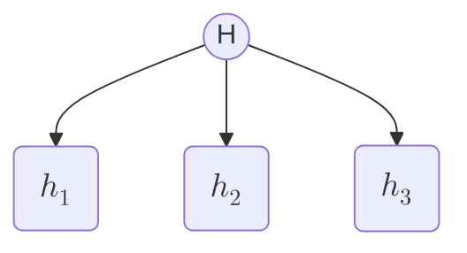

No tiene por qué ser estática, ya que cada clasificador descendiente también puede tener sus propios clasificadores previos:

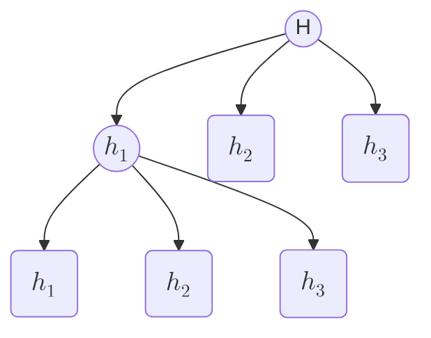

### Idea 3: decision tree stumps y error ponderado

Si tuviésemos un espacio 2D, un `decision tree stump` no sería un árbol completo, sino una única prueba.

Cada stump corresponde a una posible separación del espacio. El error de una prueba, si todas las muestras tienen el mismo peso, puede expresarse como: $$E = \sum_e \frac{1}{N}$$
donde la suma se hace sobre las muestras mal clasificadas.

Si los pesos de las muestras son distintos, entonces el error pasa a ser: $$E = \sum_e W_i$$con la condición: $$\sum W_i = 1$$

Esto permite dar más peso a las muestras difíciles o “exageradas”.
### Idea 4: combinación ponderada de clasificadores
El clasificador final puede generalizarse asignando pesos a los distintos clasificadores:$$H(x) = \operatorname{signo}(\alpha_1*h_1 + \alpha_2*h_2 + \alpha_3*h_3 +...\alpha_n*h_n)$$Esto representa una especie de “sabiduría ponderada de una multitud de expertos”, donde cada clasificador aporta según su desempeño.

### Idea 5: algoritmo iterativo de boosting
A partir de esta idea, se puede construir un proceso iterativo que ajuste los pesos de los clasificadores y de las muestras con el objetivo de minimizar el error.

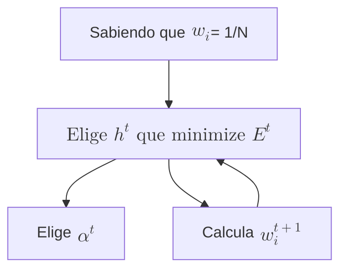
La lógica del algoritmo es:

1. Inicializar los pesos de las muestras.
2. Elegir el clasificador `h^t` que minimiza el error ponderado.
3. Calcular el peso `α^t` del clasificador.
4. Actualizar los pesos de las muestras.
5. Repetir el proceso.

### Idea 6: actualización de pesos

La actualización de los pesos puede escribirse como:$$w^{t+1}_i = \frac{w^{t}_i}{Z}e^{-\alpha^th^t(x_i)y_i}$$

donde:

- `Z` es un factor normalizador
- $h^t(x_i)$ es la predicción del clasificador en la iteración $t$
- $y_i$ es la etiqueta correcta

El valor óptimo de $\alpha^t$ viene dado por:$$\alpha^t = \frac{1}{2}\ln(\frac{1-\epsilon^t}{\epsilon^t})$$

donde $\epsilon^t$ es el error ponderado en la iteración $t$.

---

#### Observación importante

La actualización de pesos hace que:

- las muestras bien clasificadas reduzcan su peso relativo,
- las muestras mal clasificadas aumenten su importancia,
- y el siguiente clasificador se enfoque en corregir errores anteriores.

## 18. Representaciones: Clases, Trayectorias, Transiciones

### Introducción
La idea central de esta clase es que, si queremos modelar inteligencia humana, no basta con clasificadores o algoritmos que “funcionan”. También necesitamos **representaciones internas** que nos permitan entender, describir y contar historias sobre el mundo.

En particular, se proponen varias formas de representación:

- **Clasificación**
- **Transición**
- **Trayectoria**
- **Secuencia**
- **Bibliotecas de historias**

Estas representaciones forman parte de lo que podríamos llamar un posible **lenguaje interno** del pensamiento.

---

### Concepto de clasificación

Las clases representan conceptos con distintos niveles de generalidad o especificidad, y mantienen relaciones entre sí.

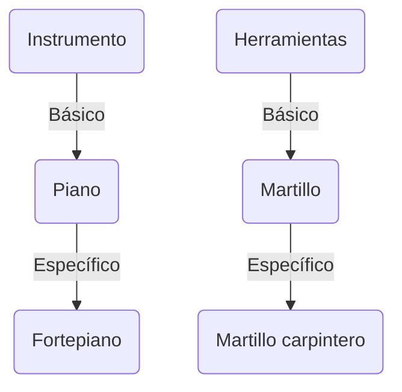

Estas clases se relacionan mediante enlaces semánticos en una dirección vertical: de lo más general a lo más específico.

A medida que una clase se vuelve más específica:

- aumenta el conocimiento que tenemos sobre ella,
- disminuye su ambigüedad,
- y se vuelve más fácil formarnos una imagen mental clara.

Las clases básicas parecen ser especialmente importantes porque sobre ellas almacenamos gran parte de nuestro conocimiento cotidiano.

### Concepto de transición
La clase propone que el pensamiento humano se basa mucho en el **cambio**.  
En vez de considerar todas las variables posibles del mundo, solemos centrarnos en lo que cambia.

Esto se expresa mediante un **vocabulario del cambio**.

|                  | Antes del choque | Durante el choque | Despues del choque |
| ---------------- | ---------------- | ----------------- | ------------------ |
| Velocidad        | $!\Delta$        | Desaparece        | $!\Lambda$         |
| distancia        | $\downarrow$     | Desaparece        | $!\Delta$          |
| estado del coche | $!\Delta$        | $\Delta$          | $!\Delta$          |

Este vocabulario permite contar historias y representar procesos dinámicos.

Los conceptos básicos de cambio son:

↑ , ↓ , Δ , Λ , Desaparece

donde:

- ↑ = incrementa,
- ↓ = decrementa,
- Δ = cambia,
- Λ = aparece,
- desaparecer = deja de estar presente.

Estos términos están muy relacionados con la visión y la percepción de eventos.

### Concepto del marco de trayectoria/rol

Otra forma de representar conocimiento es mediante **frames** o **marcos**, que organizan la información en roles.

Un marco de trayectoria suele incluir:

- un **objeto**,
- una **fuente**,
- un **destino**,
- un **agente**,
- un **instrumento**,
- un **coagente**,
- un **beneficiario**,
- o un **vehículo**.

Estos marcos ayudan a describir acciones y desplazamientos.

#### Representación en secuencias de historias
La frase **“Dani reconfortó a Cris”** no produce una imagen completamente concreta por sí sola. Sabemos que ocurrió una acción entre Dani y Cris, pero la acción exacta es ambigua.

Podemos representarlo como un marco de rol:

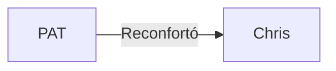
Y también como una estructura más rica, donde el resultado se interpreta como un cambio en el estado emocional:

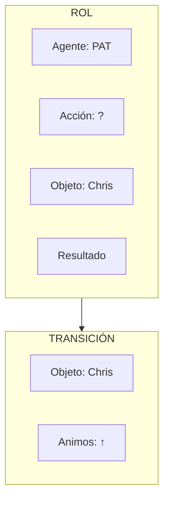

Este tipo de representación permite proyectar una escena mental usando una “librería” de situaciones aprendidas previamente.

Además, facilita el procesamiento de información al conservar la historia en una forma secuencial.

### Librería de historias
Las historias pueden organizarse en jerarquías de marcos más generales y más específicos.

Por ejemplo:

- **Event frame**
    - **Disaster frame**
        - earthquake
        - hurricane
    - **Party frame**
        - birthday party
        - wedding

Cada nivel añade más información esperable.

### Ejemplo:

- En un evento general, esperamos saber **cuándo** y **dónde** ocurrió.
- En un desastre, además, esperamos saber víctimas y coste.
- En un terremoto, esperamos magnitud y falla geológica.
- En un huracán, esperamos categoría y nombre.

Esto significa que una historia no solo es un caso particular, sino también una instancia de un marco más general.

### Concepto de trayectoria

Las historias y acciones suelen describirse como objetos moviéndose a lo largo de una trayectoria.

Un **trajectory frame** puede incluir:

- **objeto**
- **origen**
- **destino**
- **agente**
- **instrumento**
- **coagente**
- **beneficiario**
- **vehículo**

### Ejemplos:

- _Hice una tarta con mi amigo_
    
    - `con mi amigo` puede interpretarse como compañía o cooperación.
- _Hice una tarta en el horno_
    
    - `en el horno` indica instrumento.
- _Iré a Valencia en tren_
    
    - `en tren` indica vehículo.
- _El trabajo esta hecho por un estudiante_
    
    - `por un estudiante` indica agente.

Las preposiciones ayudan a fijar el rol de cada elemento dentro del marco.

---

### Concepto de secuencia

Además de clasificación, transición y trayectoria, necesitamos una cuarta representación: la **secuencia**.

La secuencia organiza eventos en orden lineal y proporciona una gran parte de la estructura del pensamiento narrativo.

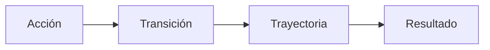

La secuencia es importante porque:

- impone orden,
- reduce ambigüedad,
- y nos permite comprender historias como cadenas de eventos conectados.

Esto es especialmente claro en música, donde no podemos recomenzar fácilmente desde cualquier punto sin perder el sentido de la secuencia.

---

### Ejemplos de secuencia en historias

#### “Dani reconfortó a Cris”

Esta oración puede interpretarse como:

- **Agente**: Dani
- **Acción**: reconfortar
- **Objeto**: Cris
- **Resultado**: mejora del ánimo de Cris

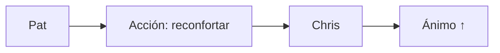

#### “Dani aterrorizó Cris”

La misma estructura puede tener un resultado opuesto:

- **Agente**: Dani
- **Acción**: aterrorizar
- **Objeto**: Chris
- **Resultado**: empeora el ánimo de Cris

#### “Dani kissed Cris”

Aquí la acción permite una imagen mental más específica.  
La trayectoria puede interpretarse según el contexto:

- Dani y Cris como pareja,
- Dani como padre o madre,
- o incluso dentro de una situación simbólica distinta.

#### “Dani stabbed Cris”

La estructura narrativa es similar, pero el resultado cambia:

- **Ánimo**: desciende
- **Salud**: desciende
- **Trayectoria**: hacia el cuerpo de Cris
- **Instrumento**: el cuchillo de Dani

Estos ejemplos muestran que una misma secuencia puede generar distintas interpretaciones semánticas.

---

### Relaciones entre representaciones

Las cuatro representaciones principales son:

1. **Clasificación**
2. **Transición**
3. **Trayectoria**
4. **Secuencia**

Estas representaciones son útiles porque aparecen con frecuencia en corpora reales.  
En particular, muchas frases de texto periodístico o narrativo pueden entenderse en alguno de estos marcos.

---

### Bibliotecas de historias

Las historias pueden agruparse en bibliotecas o familias de marcos.

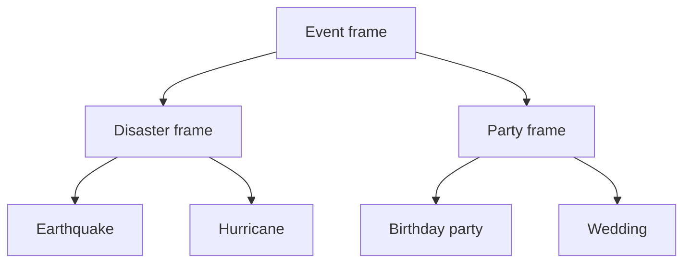

Cada subclase añade slots o expectativas específicas.

### Ejemplo:

- Un **wedding frame** nos hace esperar información sobre:
    
    - novio
    - novia
    - lugar
    - fecha
- Un **earthquake frame** nos hace esperar:
    
    - magnitud
    - localización
    - falla geológica

---

### Idea final

La clase sugiere que la inteligencia humana depende de una especie de **lenguaje interno** formado por:

- clases,
- cambios,
- trayectorias,
- secuencias,
- y bibliotecas de historias.

Estas estructuras nos permiten entender el mundo, contar historias y razonar con más eficacia.

En resumen:

- **Clasificación** organiza conceptos.
- **Transición** describe cambios.
- **Trayectoria** modela movimientos y roles.
- **Secuencia** da estructura narrativa.
- **Librerías de historias** permiten reutilizar conocimiento.

Todo esto forma parte de cómo pensamos y comprendemos.

## 19. Arquitecturas: GPS, SOAR, Subsumption, Society of Mind

### Introducción

En esta clase se presentan distintas **arquitecturas de la inteligencia artificial**, es decir, formas de organizar los ingredientes que ya hemos visto:

- **Representaciones**
- **Métodos**
- **Mecanismos de percepción, razonamiento y acción**

La idea general es que no basta con tener estos componentes por separado: hay que saber **cómo combinarlos** para obtener un sistema que se comporte de forma inteligente.

### General Problem Solver
El "**General Problem Solver**" (**GPS**) es una de las primeras arquitecturas de IA, desarrollada por **Newell y Simon** en Carnegie Mellon.

Su idea central es la de **análisis medios-fines** (_means-ends analysis_):  
partimos de un estado actual y tratamos de acercarnos al objetivo reduciendo progresivamente la diferencia entre ambos.

#### Esquema básico

1. Se parte de un estado actual, $C$
2. Se define un estado objetivo, $S$
3. Se calcula la diferencia simbólica entre ambos, $D$
4. Esa diferencia determina un operador, $O$ , que lleva a un estado intermedio, $I$
5. Desde ese nuevo estado se vuelve a calcular una nueva diferencia, $D2$
6. Se elige otro operador, $O2$ , y así sucesivamente

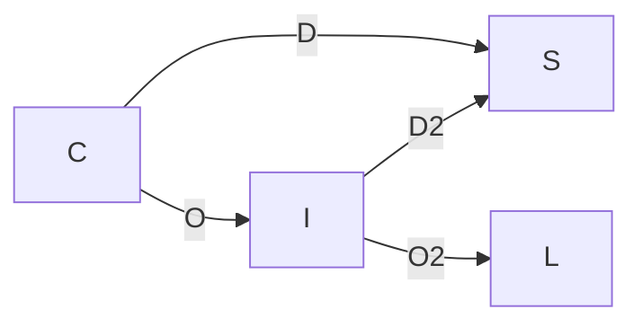

#### Idea principal

La arquitectura asume que resolver problemas consiste en:

- identificar la **diferencia** entre situación actual y objetivo,
- elegir un **operador** que reduzca esa diferencia,
- repetir el proceso hasta alcanzar la meta.

#### Limitación importante

Aunque es una arquitectura muy influyente, tiene una restricción fundamental:

- antes de usarla, un humano debe haber definido previamente:
    - qué diferencias pueden aparecer,
    - qué operadores existen para resolverlas,
    - y cómo se relacionan diferencias y operadores.

Es decir, el problema de construir la tabla de correspondencias entre estados, diferencias y operadores queda **fuera** de la arquitectura.

#### Hipótesis asociada

Esta arquitectura está basada en la llamada **hipótesis del sistema simbólico**:

> la inteligencia humana puede entenderse como manipulación de símbolos.

### SOAR
**SOAR** es una evolución más elaborada de GPS.  
Originalmente significaba _State, Operator, And Result_, aunque hoy se usa más como nombre propio que como acrónimo.
#### Componentes principales

SOAR contiene varias partes:

- **Memoria a largo plazo (LTM)**
    - afirmaciones
    - reglas
    - producciones
- **Memoria a corto plazo (STM)**
    - donde ocurre el procesamiento principal
- **Acceso al mundo real**
    - entradas perceptivas
    - salidas de acción

#### Funcionamiento

1. Las reglas y afirmaciones de la **LTM** se activan si encajan con la situación actual.
2. Esa información pasa a la **STM**, donde se realiza el procesamiento.
3. Si hay varias reglas posibles, se usa un sistema de **preferencias** para decidir.
4. El problema se organiza en **espacios de problemas**, que son dominios de búsqueda.
5. Si no se sabe qué hacer a continuación, se genera un nuevo subproblema mediante **universal subgoaling**.
#### Conceptos clave de SOAR

1. **STM y LTM**
2. **Afirmaciones y reglas** (_producciones_)
3. **Sistema de preferencias**
4. **Espacios de problemas**
5. **Universal subgoaling**

#### Idea central

SOAR sigue estando orientado al **razonamiento simbólico** y a la resolución de problemas, pero con una arquitectura más completa y flexible que GPS.

#### Hipótesis asociada

SOAR también se apoya en la **hipótesis del sistema simbólico**, según la cual pensar consiste en manipular símbolos.
### Emotion machine
La arquitectura de Marvin Minsky, descrita en _The Emotion Machine_, amplía la idea de resolver problemas, pero insiste en que el pensamiento humano no es de un solo nivel.
#### Idea principal

Minsky propone que el pensamiento ocurre en **varias capas** o niveles, que pueden activarse según la situación.

#### Niveles de pensamiento

1. **Reacción instintiva**
    - respuestas automáticas y casi innatas
2. **Reacción aprendida**
    - respuestas adquiridas por experiencia
3. **Pensamiento deliberativo**
    - resolución consciente de problemas
4. **Pensamiento reflexivo**
    - pensar sobre lo que uno está pensando o haciendo
5. **Auto-reflexión**
    - pensar en relación con planes, metas y emociones propias
6. **Auto-conciencia**
    - pensar en relación con otros y con la imagen social de uno mismo

#### Idea importante

La gran aportación de Minsky es que la inteligencia no es solo resolver problemas, sino **cambiar entre distintos modos de pensar**.

#### Hipótesis asociada

Se puede ver como una versión de la **hipótesis del sentido común**:

> para pensar como humanos, una máquina necesita sentido común.

### Subsumption

La arquitectura de **Rod Brooks** fue una reacción contra la visión clásica de la IA basada en planificación, representación y razonamiento simbólico.
#### Hipótesis de la criatura

Brooks propone la **hipótesis de la criatura**:

> si consigues que un robot se comporte como un insecto, el resto será más fácil.

La idea es empezar por comportamientos básicos y reactivos antes de aspirar a inteligencia compleja.
#### Enfoque arquitectónico

En lugar de separar el sistema en:

- visión,
- razonamiento,
- acción,

Brooks propone una arquitectura por **capas de comportamiento**, cada una responsable de una tarea concreta.

#### Ejemplo de capas

- **Esquivar obstáculos**
- **Vagar**
- **Explorar**
- **Buscar**

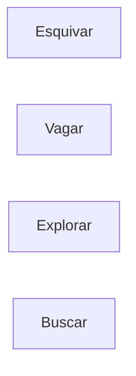

#### Principios de la arquitectura

1. **No representación**
2. **Usar el mundo en vez de un modelo**
3. **Máquinas de estado finitas**
#### Interpretación

- No hace falta construir un modelo completo del mundo.
- El robot puede reaccionar continuamente al entorno.
- Las capas se construyen como **barreras de abstracción**: una vez funcionan, no se modifican profundamente.
#### Ejemplo clásico

Un ejemplo famoso es el robot **Herbert**, un robot móvil capaz de:

- navegar por pasillos,
- detectar latas,
- recogerlas con un brazo,
- y volver a “casa” sin necesidad de un mapa global.

Eso ilustra la potencia de sistemas reactivos simples pero bien organizados.
### Genesis
La arquitectura **Genesis** está muy centrada en el **lenguaje**.
#### Idea principal

El lenguaje cumple dos funciones:

1. **Guiar y coordinar la percepción**
2. **Permitir describir eventos**

#### Lenguaje y percepción

El lenguaje no solo sirve para narrar, sino también para:

- dirigir la atención,
- activar sistemas perceptivos,
- organizar la interpretación de lo que vemos.

#### Ejemplo

Si alguien pregunta:

> “¿Hay alguien en la primera fila con vaqueros azules?”

automáticamente dirigimos la mirada hacia esa zona.  
Eso muestra cómo el lenguaje puede influir directamente en la percepción y la acción.
#### Lenguaje y representación de eventos

La capacidad de describir eventos permite:

- entender historias,
- interpretar secuencias de acciones,
- relacionar eventos con causas y consecuencias.

Esto lleva a una comprensión más rica de:

- **microcultura**
- **macrocultura**

#### Hipótesis asociada

Genesis se relaciona con la **hipótesis de las historias fuertes**:

> la capacidad de contar y entender historias es central para la inteligencia humana.

### Story Hypothesis

La clase termina enfatizando la importancia de las **historias** como mecanismo cognitivo.
#### Hipótesis débil

> Las historias son importantes.

#### Hipótesis fuerte

> Las historias no solo son importantes, sino que son fundamentales para la inteligencia.

#### Experimento de orientación espacial

Se menciona un experimento clásico:

- se coloca comida u objeto en una habitación rectangular,
- se desorienta al sujeto,
- y se observa hacia qué esquina va.

##### Resultados

- **Ratas**: utilizan la geometría de la habitación
- **Niños pequeños**: hacen algo similar
- **Adultos**: solo distinguen una esquina correctamente cuando pueden usar **lenguaje espacial**

#### Importancia del lenguaje

El desarrollo del uso de palabras como:

- **izquierda**
- **derecha**

parece tener relación con la capacidad de romper la simetría espacial y orientarse correctamente.
#### Segundo experimento: interferencia lingüística

Si a un adulto se le pide hacer una **tarea de traducción simultánea**, su rendimiento espacial empeora.

Esto sugiere que:

- el lenguaje participa en la construcción de descripciones mentales,
- y que si se bloquea el lenguaje, se degrada parte del razonamiento.
#### Conclusiones prácticas

1. **Leer, escribir, dibujar y hablar** ayudan a pensar mejor.
2. Tomar apuntes no solo ayuda a recordar, sino que activa procesos cognitivos.
3. Hay que desconfiar de los **habladores rápidos**, porque pueden saturar el sistema lingüístico y dificultar el pensamiento crítico.

---

### Resumen final de las arquitecturas

#### 1. GPS

- Búsqueda simbólica por reducción de diferencias
- Basado en análisis medios-fines
- Muy general, pero depende de una tabla previa de operadores
#### 2. SOAR

- Arquitectura simbólica más rica
- Memoria a corto y largo plazo
- Reglas, preferencias, espacios de problemas y subgoals
#### 3. Emotion Machine

- Pensamiento por capas
- Reacción, deliberación, reflexión y auto-conciencia
- Importancia del sentido común
#### 4. Subsumption

- Arquitectura reactiva
- Sin modelo explícito del mundo
- Capas de comportamiento para robots
#### 5. Genesis

- Arquitectura centrada en el lenguaje
- El lenguaje guía percepción y acción
- Las historias son clave para la inteligencia

## 21 Inferencia probabilística I
La inferencia probabilística se basa en el concepto de **contar ocurrencias** de combinaciones posibles y convertir esos recuentos en probabilidades mediante normalización: $$\large \frac{nº_c}{nº_t}$$ 

donde:

- $n^o_c$ = número de casos favorables
- $n^o_t$ = número total de casos

### Problema del enfoque tabular

El principal problema de este enfoque es que el número de combinaciones crece muy rápidamente con el número de variables.

Si tenemos n variables binarias, el número de filas en la tabla conjunta es:$$\large 2^n$$
Por tanto, el volumen de datos necesario crece exponencialmente.

### Interpretaciones de la probabilidad

Hay varias maneras de interpretar estos valores:

1. **Interpretación frecuentista**
    
    - la probabilidad representa la frecuencia con la que ocurre un evento en muchas repeticiones
2. **Interpretación subjetiva o bayesiana**
    
    - la probabilidad representa un grado de creencia
3. **Propensión natural**
    
    - la probabilidad se interpreta como una tendencia o disposición objetiva del mundo

### Motivación

Como las tablas conjuntas completas se vuelven rápidamente inmanejables, necesitamos **modelos matemáticos** que permitan representar y razonar con probabilidades de forma más compacta.

#### Probabilidad básica
Axiomas:
1. La probabilidad está acotada entre 0 y 1: $\large 1 \geq P(a) \geq 0$
2. Probabilidad binaria
	1. $P(verdadero)=1$
	2. $P(falso)=0$
3. Regla de adición: $P(a) + P(b) - P(a,b) = P(a|b)$

#### Probabilidad condicional
Definición:
$$P(a|b) \equiv \frac{P(a,b)}{P(b)}$$
Por lo que la probabilidad siguiente: $P(a,b,c)$ es igual a:
$$\large P(a,b,c) = P(a,y) \text{ teniendo en cuenta que } y=b,c$$
$$\large P(a,y) = P(a|y)P(y) = P(a|b,c)P(b,c) = P(a|b,c)P(b|c)P(c)$$

#### Regla de la cadena
Lo cual puede generalizarse de la siguiente manera:$$\large P(x_1....,x_n) = \prod_{i=n}^{1} P(x_i|x_{i-1}, ... x_i)$$
### Independencia

#### Definición

Dos variables a y b son independientes si:
$$\large P(a|b) = P(a) \text{ si a es independiente de b}$$

### Independencia condicional

#### Definición

$a$ y $b$ son condicionalmente independientes dado $z$ si:
$$\large P(a|bz) = P(a|z)$$
De la misma manera$$\large P(ab|z) = P(a|z)P(b|z) $$Esto significa que, una vez conocido $z$ , la información adicional sobre $b$ ya no cambia la probabilidad de $a$ .
#### Regla de la cadena

### Redes de creencias

Una **red de creencias** (_belief network_ o _Bayesian network_) es una representación compacta de una distribución conjunta usando:

- un **grafo dirigido acíclico**
- relaciones de dependencia entre variables
- tablas de probabilidad condicional para cada nodo

La idea clave es que **cada nodo solo depende de sus padres**.

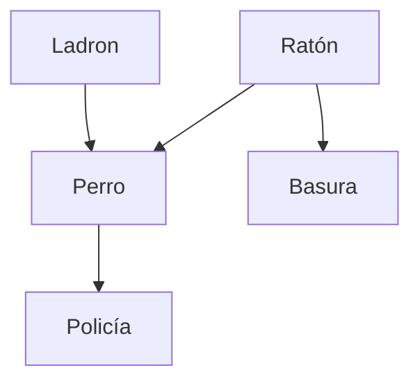

En este ejemplo:

- **Perro** depende de **Ladrón** y **Ratón**
- **Policía** depende de **Perro**
- **Basura** depende de **Ratón**
- **Ladrón** y **Ratón** son variables independientes de raíz

### Reducción del número de parámetros

Si quisiéramos describir la distribución conjunta de 5 variables binarias con una tabla completa, necesitaríamos:

$2^5 = 32$

valores.

Pero usando una red bayesiana, basta con especificar las probabilidades locales:
- P ( Ladrón )
- P ( Ratón )
- P ( Perro ∣ Ladrón , Ratón )
- P ( Policía ∣ Perro )
- P ( Basura ∣ Ratón )

Esto reduce drásticamente el número de parámetros.

Teniendo las siguientes probabilidades: $\large P(Ladron) = 0.1, P(Raton)=0.5$

La probabilidad de que el perro ladre, se da en la siguiente tabla:

| Policía | Ratón | P(Perro) |
| ------- | ----- | -------- |
| F       | F     | 0.1      |
| T       | F     | 1.0      |
| F       | T     | 0.5      |
| T       | T     | 1.0      |
De la misma manera que la probabilidad de que se llame a la policía es la siguiente

| Perro | P(Policía) |
| ----- | ---------- |
| F     | 0.01       |
| T     | 0.1        |
Y las probabilidades de que la rata tire la basura las siguientes

| Rata | P(Basura) |
| ---- | --------- |
| F    | 0.001     |
| T    | 0.8       |
Gracias a la interdependencia de los nodos y sus probabilidades, se han reducido las variables necesarias de $\large 2^n \text{ (siendo n = 5) } \rightarrow 10$, las cuales se expresan en la siguiente formula de probabilidad dependiente: $$\large P(policia,perro,ladron,basura,raton) =
$$$$P(policia|perro,ladron,basura,raton)P(perro|ladron,basura,raton)P(ladron|basura,r)P(basura|raton)P(raton)$$
Pudiendo eliminar de las probabilidades condicionales aquellas variables las cuales no tienen relación de dependencia.

### Idea clave de la clase

La gran ventaja de las redes de creencias es que permiten:

- representar distribuciones complejas con muchos menos parámetros,
- aprovechar independencia condicional,
- calcular probabilidades conjuntas a partir de tablas locales pequeñas.

En el ejemplo de 5 variables:

- tabla completa: **32 valores**
- red bayesiana: **10 valores**

---

### Resumen

1. La probabilidad puede obtenerse por **frecuencias**.
2. Las tablas conjuntas crecen como 2 n .
3. La probabilidad básica se apoya en axiomas simples.
4. La probabilidad condicional permite descomponer distribuciones.
5. La independencia y la independencia condicional reducen la complejidad.
6. Las **redes de creencias** factorizaron el problema de forma eficiente.

## 22 Inferencia probabilística II
En esta clase se profundiza en el uso de **redes bayesianas** para:

- calcular probabilidades conjuntas a partir de tablas locales,
- hacer **inferencia ingenua de Bayes**,
- y llegar finalmente al **descubrimiento de estructura**.

### Repaso: red bayesiana e inferencia

Podemos representar las relaciones entre nodos mediante una lista ordenada de variables, por ejemplo: $$C \text{ / } D \text{ / }B \text{ / }T \text{ / }R $$A partir de esa ordenación, la **regla de la cadena** permite escribir la distribución conjunta como:                                                  $\large P(C,D,B,T,R) =$ $$P(C|D,B,T,R)P(D|B,T,R)P(B|TR)P(T|R)P(R) $$Sin embargo, si el grafo está bien definido, podemos usar la **independencia condicional** para simplificarla.

En una red bayesiana, cada variable es independiente de sus **no descendientes**, dado sus **padres**.  
Por tanto, la expresión anterior se reduce a:$$P(C|D)P(D|B,R)P(T|R)P(B)P(R) $$
Esto permite calcular cualquier combinación de valores a partir de tablas locales mucho más pequeñas.
![[Pasted image 20260416085757.png]]
### Modelo
Una vez obtenidas frecuencias de observación, podemos construir tablas de **probabilidades condicionales** para cada nodo.

Estas tablas son útiles porque, una vez fijados los valores de los nodos padres —por ejemplo, mediante una simulación o un sorteo—, solo hay que consultar la probabilidad correspondiente a esa combinación concreta.

### Idea clave

- Los **padres** determinan qué fila de la tabla usar.
- El nodo hijo se calcula a partir de esa probabilidad condicional.

El problema de este método es que depende críticamente de que las relaciones entre nodos estén bien definidas.

### Inferencia Naive Bayesiana
Partimos de la definición de probabilidad condicional:$$P(a|b) \equiv \frac{P(a,b)}{P(b)}$$ Podemos expresar $\large P(a,b)$ indistintamente de las siguientes maneras:
- $\large P(a,b) = P(a|b)P(b)$
- $\large P(a,b) = P(b|a)P(a)$

Con lo que podemos reescribir la definición dela siguiente manera: $$P(a|b) = \frac{P(b|a)P(a)}{P(b)} $$
### Interpretación en clasificación

Esta forma es especialmente útil en problemas de **diagnóstico** o **clasificación**.

- a = **clase** o causa que queremos predecir
    - por ejemplo: una enfermedad
- b = **evidencia** o síntomas observados

En muchos casos es más fácil modelar:

$\large P ( b ∣ a )$

que modelar directamente:

$\large P ( a ∣ b )$

Es decir:

- predecir los **síntomas dada la enfermedad** suele ser más fácil,
- que predecir la **enfermedad dados los síntomas**.

### Inferencia ingenua con evidencias independientes

Si la evidencia está formada por varias observaciones:

$\large e_1 , e_2 , … , e_n$

y suponemos que son **independientes dado la clase** $\large c_i$ , entonces:

$$\large P ( e_1 , … , e_n ∣ c_i ) = ∏_{j= 1}^n P ( e_j ∣ c_i )$$

Por tanto:

$$\large P ( c_i ∣ e_1 , … , e_n ) ∝ P ( c_i ) ∏_{j = 1}^n P ( e_j ∣ c_i )$$

Esto es el principio del **Naive Bayes** o **clasificador ingenuo de Bayes**.

### Idea

La independencia condicional simplifica muchísimo el cálculo y permite hacer clasificación eficaz incluso con muchos síntomas o indicadores.

---

### Ejemplo: clasificación de monedas

Un ejemplo clásico es distinguir entre dos monedas:

- una moneda justa:$P ( H ) = 0.5$
- una moneda sesgada: $P ( H ) = 0.8$

Supongamos que escogemos una moneda al azar y observamos la secuencia de lanzamientos.

### Paso 1: evidencia inicial

Si obtenemos:

- cara
- cruz

podemos comparar cuál de las dos monedas hace más probable esa secuencia.

### Interpretación

A medida que acumulamos evidencia, actualizamos la probabilidad de que la moneda elegida sea una u otra.

- si aparecen muchos resultados compatibles con la moneda sesgada, su probabilidad sube,
- si aparece un resultado incompatible, su probabilidad puede caer a 0 en algunos modelos.

Esto ilustra cómo la evidencia empuja la inferencia hacia una hipótesis u otra.
### Selección de modelos y descubrimiento de estructura

Aquí aparece una idea más potente: no solo queremos clasificar clases, sino también decidir **qué estructura de modelo es mejor**.

### Dos modelos posibles

Podemos tener dos redes o dos hipótesis estructurales distintas:

- modelo izquierdo
- modelo derecho

A partir de datos observados, comparamos cuál explica mejor las observaciones.

### Bayes para comparar modelos

Para cada modelo $M_i$ :

$P ( M_i ∣ datos ) ∝ P ( datos ∣ M_i ) P ( M_i )$

Si asumimos priors similares, la comparación puede hacerse principalmente por la verosimilitud de los datos bajo cada modelo.

---

### Descubrimiento de estructura

Esto va más allá de la clasificación: ya no solo se predice una clase, sino que se intenta descubrir **la estructura correcta del grafo**.

### Problema

Hay muchísimas redes posibles.

Incluso restringiendo:

- que no haya ciclos,
- y que cada nodo tenga pocos padres,

el número de estructuras posibles es enorme.
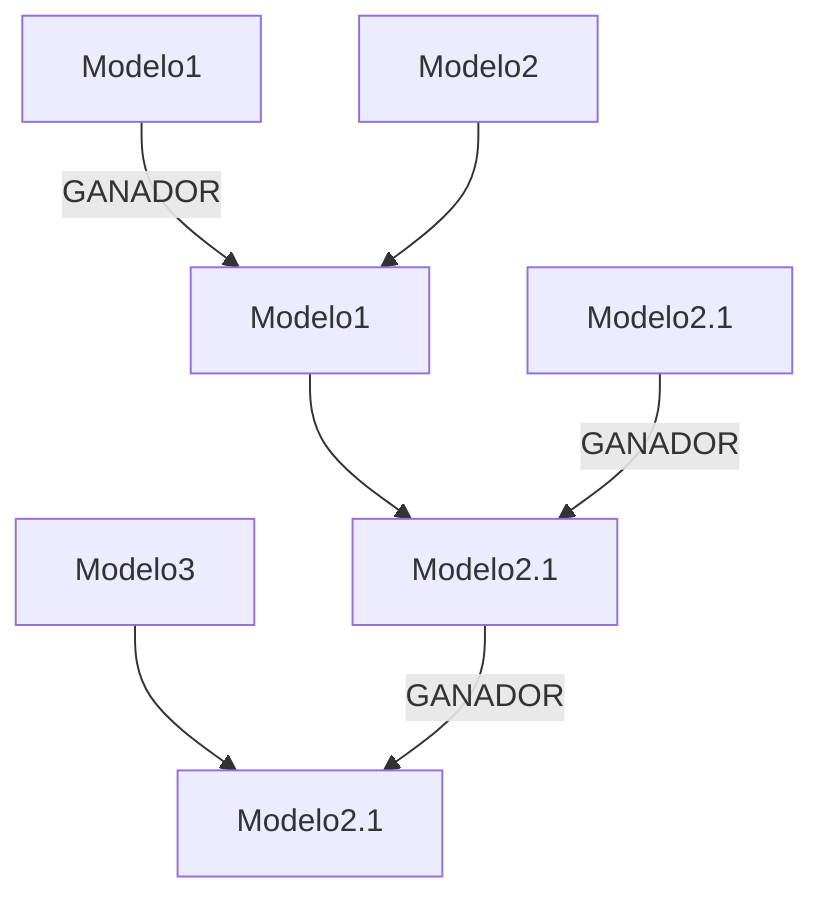
### Solución: búsqueda

No se prueban todas las redes.  
En su lugar, se hace **búsqueda** en el espacio de modelos:

1. se parte de una red inicial,
2. se modifica ligeramente,
3. se evalúa,
4. se mantiene la mejor encontrada,
5. y se repite.

---

### Función de puntuación

Para evitar problemas numéricos al multiplicar probabilidades muy pequeñas, se usa la suma de logaritmos:

$$\large \sum \log P(modelo)$$

En lugar de multiplicar probabilidades, se suman sus logaritmos.

Esto evita el **underflow** y es más práctico computacionalmente.

---

### Máximos locales y reinicio aleatorio

El espacio de modelos suele ser:

- muy grande,
- muy irregular,
- lleno de máximos locales.

Por eso se usa:

- **búsqueda local**
- **reinicio aleatorio** (_random restart_)

La idea es:

- conservar el mejor modelo visto hasta el momento,
- pero de vez en cuando saltar a una región distinta del espacio de búsqueda,
- para evitar quedar atrapado en un máximo local.

---

### Aplicaciones

La clase termina destacando que la inferencia bayesiana es útil en muchos problemas de diagnóstico:

- diagnóstico médico,
- detección de mentiras,
- evaluación del conocimiento en exámenes,
- diagnóstico de fallos en sistemas,
- análisis de causas probables en programas o máquinas.

En todos estos casos:

- observamos **síntomas** o **evidencias**,
- y queremos inferir la **causa** más probable.

---

### Ideas clave de la clase

1. La regla de la cadena permite factorizar una distribución conjunta.
2. Las redes bayesianas aprovechan la independencia condicional.
3. Bayes permite invertir una relación causal o diagnóstica.
4. Naive Bayes simplifica el cálculo suponiendo independencia entre evidencias dadas la clase.
5. La inferencia bayesiana también sirve para comparar modelos.
6. El descubrimiento de estructura requiere búsqueda en un espacio enorme de hipótesis.
7. Se usa la suma de log-probabilidades para evitar problemas numéricos.
8. Los reinicios aleatorios ayudan a escapar de máximos locales.

---

### Resumen corto

La gran idea de esta clase es que la probabilidad no solo sirve para calcular resultados, sino también para:

- **clasificar clases**
- **comparar modelos**
- **descubrir estructuras**.

## 23 Model Merging, Cross-Modal Coupling

### Fusionado de historias bayesianas
Puede darse el caso de dos historias que empiezan y acaban en el mismo punto:

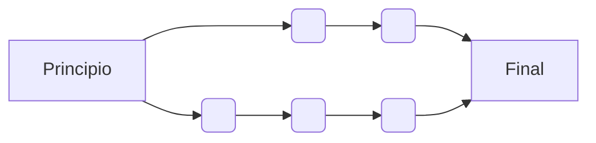
Y en este caso, puede que alguno de los nodos de la historia tengan muchas similitudes:
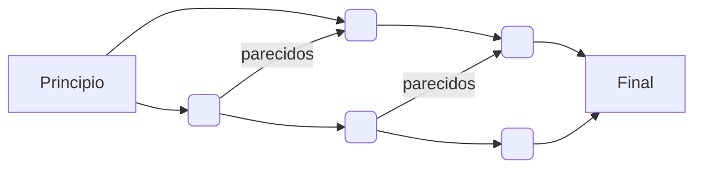
Con lo que una representación mas cercana a la realidad podria ser la siguiente:
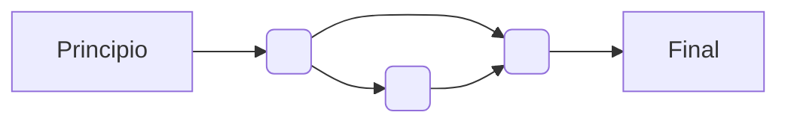

![[Pasted image 20260417093325.png]]

### Cross-Modal coupling
Ya que esencialmente se estan enlazando conceptos, esta idea también se puede aplicar a, por ejemplo, la relación entre los gestos de la boca y los sonidos que esta hace al hablar.

En este caso se pretende relacionar un cluster de valores de la transformada de fourier del sonido, con un cluster de aperturas de la boca. Este problema se conoce como Cross-Modal coupling, debido a que tiene información en dos dominios diferentes.

